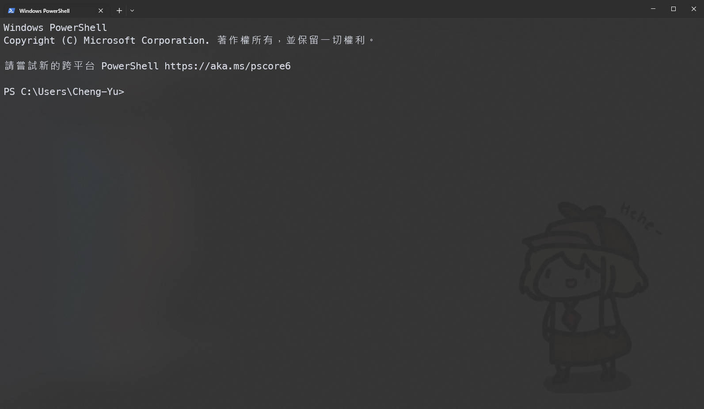

# windows_terminal  
beautiful windows terminal for happy coding  

# Setup  
1. Install "windows terminal" in Microsoft store  
2. Open it press "Ctrl+Shift+,"  
3. Paste all things in setting.json to your setting.json  
4. Change your image path in setting.json  
5. Enjoy  

# Example  

  

